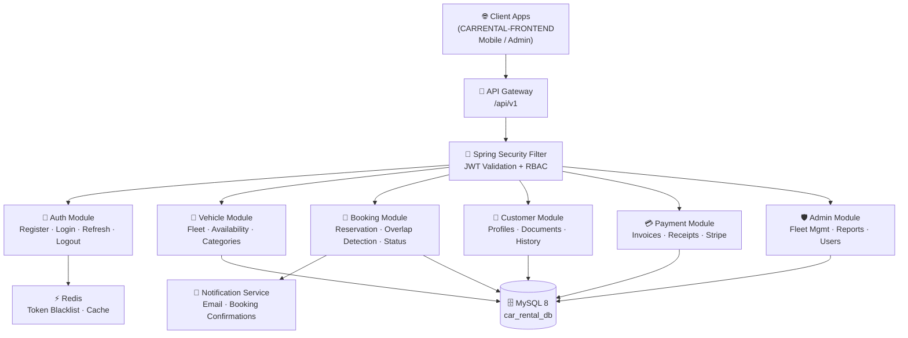
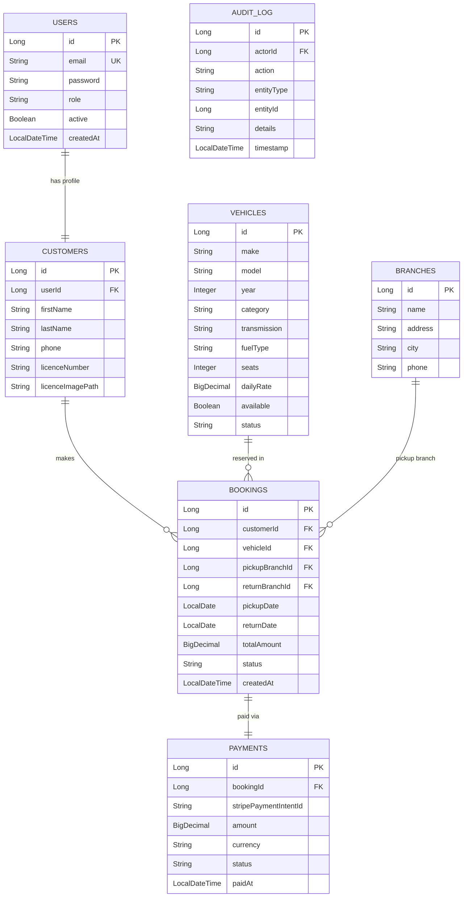

<div align="center">


<p align="center">
  
  
  
  
  
  
</p>

<h3>⚙️ A production-grade open-source alternative to RENTALL, RentWorks & TSD Rental backends</h3>
<p>Built for <strong>Java developers, full-stack teams & car rental businesses</strong> — a fully-featured Spring Boot 3 REST API powering vehicle management, customer authentication, booking workflows, payment processing, and fleet administration — the backend engine behind the <a href="https://github.com/Shadhai/CARRENTAL-FRONTEND">CARRENTAL-FRONTEND</a>.</p>

<p align="center">
  <a href="#-quick-start"></a>
  &nbsp;
  <a href="#-api-reference"></a>
  &nbsp;
  <a href="#-features"></a>
</p>

</div>

---

## 📋 Table of Contents

- [Purpose & Philosophy](#-purpose--philosophy)
- [System Architecture](#-system-architecture)
- [Features](#-features)
- [Tech Stack](#-tech-stack)
- [Quick Start](#-quick-start)
- [Configuration](#-configuration)
- [API Reference](#-api-reference)
- [Security & Authentication](#-security--authentication)
- [Database Schema](#-database-schema)
- [Use Cases](#-use-cases)
- [Project Structure](#-project-structure)
- [Docker Deployment](#-docker-deployment)
- [Testing](#-testing)
- [Troubleshooting](#-troubleshooting)
- [Roadmap](#-roadmap)
- [Contributing](#-contributing)
- [AI-Ready Files](#-ai-ready-files)
- [License](#-license)

---

## 🎯 Purpose & Philosophy

> **Problem:** Most car rental backends are either monolithic PHP legacy systems, expensive SaaS platforms with per-booking fees, or minimal CRUD prototypes that break under real business load. Java developers building rental platforms end up re-writing the same auth flows, booking conflict detection, availability logic, and fleet management modules from scratch — every single time.

**Ultimate Car Rental Backend** solves this with a battle-hardened Spring Boot 3 REST API that handles every layer of a car rental operation — vehicle fleet management, customer onboarding, conflict-free booking orchestration, role-based admin access, and payment tracking — all deployable to any Java host in under 10 minutes.

Core principles:
- 🔐 **Security First** — Spring Security 6 with JWT (access + refresh token rotation), BCrypt password hashing, and method-level role enforcement baked in from day one
- 🧩 **Layer Separation** — Strict Controller → Service → Repository pattern; zero business logic leaks into controllers; every layer independently testable
- ⚡ **Conflict-Safe Bookings** — Database-level locking and overlap detection prevent double-bookings even under concurrent load
- 📊 **Audit Trail** — Every booking state change, payment event, and admin action is logged with timestamp, actor, and before/after snapshot

---

## 🏗 System Architecture



> **Flow:** All requests pass through Spring Security's JWT filter → Role-validated controller → Service layer (business logic + conflict detection) → JPA Repository → MySQL. Booking confirmations fire async email notifications. Token blacklisting uses Redis for instant logout invalidation.

---

## ✨ Features

| Module | Capability | Auth Required | Role |
|:---|:---|:---:|:---|
| 🔐 **Authentication** | Register, Login, JWT Refresh, Logout, Password Reset | ❌ / ✅ | Public / All |
| 🚗 **Vehicle Management** | CRUD fleet, categories, specs, images, availability toggle | ✅ | Admin |
| 🔍 **Vehicle Search** | Filter by category, seats, transmission, fuel, date range | ❌ | Public |
| 📅 **Booking Engine** | Create, modify, cancel reservations with overlap detection | ✅ | Customer, Admin |
| ✅ **Availability Check** | Real-time vehicle availability for any date range | ❌ | Public |
| 👥 **Customer Profiles** | Register, update profile, driving licence upload, history | ✅ | Customer, Admin |
| 💳 **Payment Tracking** | Invoice generation, payment status, Stripe webhook support | ✅ | Customer, Admin |
| 📍 **Branch / Location** | Manage pickup/return branches with operating hours | ✅ | Admin |
| 🛡️ **Admin Dashboard API** | Fleet stats, revenue reports, booking summaries | ✅ | Admin |
| 📧 **Email Notifications** | Booking confirmation, cancellation, payment receipts | ✅ | System |
| 📋 **Audit Logging** | Immutable log of every state-changing operation | ✅ | Admin |
| 📖 **Swagger UI** | Auto-generated interactive API documentation | ❌ | Public |

---

## 🛠 Tech Stack

| Layer | Technology |
|:---|:---|
| **Language** | Java 17 (LTS) |
| **Framework** | Spring Boot 3.x |
| **Security** | Spring Security 6 + JWT (jjwt) |
| **Persistence** | Spring Data JPA + Hibernate 6 |
| **Database** | MySQL 8.0 |
| **Migrations** | Flyway |
| **Build Tool** | Maven 3.9 |
| **API Docs** | SpringDoc OpenAPI 3 (Swagger UI) |
| **Email** | Spring Mail + JavaMailSender |
| **Caching / Token Blacklist** | Redis (Spring Cache) |
| **Payments** | Stripe Java SDK |
| **Validation** | Jakarta Bean Validation (Hibernate Validator) |
| **Mapping** | MapStruct |
| **Testing** | JUnit 5 + Mockito + Spring Boot Test |
| **Containerisation** | Docker + Docker Compose |

---

## ⚡ Quick Start

> **3 commands. API running in under 5 minutes.**

### Prerequisites

- [Java 17+](https://adoptium.net/) (JDK — not JRE)
- [Maven 3.9+](https://maven.apache.org/install.html)
- [MySQL 8.0+](https://dev.mysql.com/downloads/) *(or Docker — recommended)*
- [Git](https://git-scm.com)

### Step 1 — Clone

```bash
git clone https://github.com/Shadhai/Ultimate_Car_Rental_Backend-Spring-Boot-.git
cd Ultimate_Car_Rental_Backend-Spring-Boot-
```

### Step 2 — Configure

```bash
# Copy the configuration template
cp src/main/resources/application.example.properties \
   src/main/resources/application.properties

# Edit database credentials and JWT secret
nano src/main/resources/application.properties

# Create the MySQL database
mysql -u root -p -e "CREATE DATABASE car_rental_db CHARACTER SET utf8mb4 COLLATE utf8mb4_unicode_ci;"
```

### Step 3 — Run

```bash
# Build and start the application
mvn spring-boot:run
```

```
✅ Server running at:    http://localhost:8080
📖 Swagger UI at:        http://localhost:8080/swagger-ui/index.html
📋 OpenAPI JSON at:      http://localhost:8080/v3/api-docs
🗄️ Database:             car_rental_db (MySQL)
🔑 Default admin:        admin@carrental.com / Admin@1234
```

> ⚠️ Change default admin credentials immediately. Flyway will auto-run migrations on startup.

---

## 🔧 Configuration

### `src/main/resources/application.properties`

```properties
# ── Server ─────────────────────────────────────────────────────
server.port=8080
spring.application.name=ultimate-car-rental-backend

# ── Database (MySQL) ────────────────────────────────────────────
spring.datasource.url=jdbc:mysql://localhost:3306/car_rental_db?useSSL=false&serverTimezone=UTC&allowPublicKeyRetrieval=true
spring.datasource.username=root
spring.datasource.password=your_mysql_password
spring.datasource.driver-class-name=com.mysql.cj.jdbc.Driver

# ── JPA / Hibernate ─────────────────────────────────────────────
spring.jpa.hibernate.ddl-auto=validate
spring.jpa.show-sql=false
spring.jpa.properties.hibernate.dialect=org.hibernate.dialect.MySQL8Dialect
spring.jpa.properties.hibernate.format_sql=true

# ── Flyway Migrations ───────────────────────────────────────────
spring.flyway.enabled=true
spring.flyway.locations=classpath:db/migration
spring.flyway.baseline-on-migrate=true

# ── JWT Authentication ──────────────────────────────────────────
app.jwt.secret=your-jwt-secret-key-must-be-at-least-256-bits-long
app.jwt.access-token-expiry-ms=900000
app.jwt.refresh-token-expiry-ms=604800000

# ── CORS ────────────────────────────────────────────────────────
app.cors.allowed-origins=http://localhost:5173,http://localhost:3000
app.cors.allowed-methods=GET,POST,PUT,PATCH,DELETE,OPTIONS

# ── Email (Spring Mail) ─────────────────────────────────────────
spring.mail.host=smtp.gmail.com
spring.mail.port=587
spring.mail.username=your-email@gmail.com
spring.mail.password=your-app-password
spring.mail.properties.mail.smtp.auth=true
spring.mail.properties.mail.smtp.starttls.enable=true

# ── Redis (Token Blacklist + Cache) ─────────────────────────────
spring.data.redis.host=localhost
spring.data.redis.port=6379

# ── Stripe Payment ──────────────────────────────────────────────
stripe.api.secret-key=sk_test_your_stripe_secret_key
stripe.webhook.secret=whsec_your_stripe_webhook_secret

# ── File Upload (Vehicle Images) ────────────────────────────────
spring.servlet.multipart.max-file-size=10MB
spring.servlet.multipart.max-request-size=10MB
app.upload.dir=uploads/vehicles/

# ── Swagger / OpenAPI ───────────────────────────────────────────
springdoc.api-docs.path=/v3/api-docs
springdoc.swagger-ui.path=/swagger-ui/index.html
springdoc.swagger-ui.try-it-out-enabled=true
```

<!-- ⚠️ README inferred from repo name — update all placeholder values before publishing -->

---

## 📖 API Reference

> 📌 Full interactive documentation available at **`http://localhost:8080/swagger-ui/index.html`** when the server is running.

### 🔐 AuthenticationController

| Method | Endpoint | Description | Auth |
|:---:|:---|:---|:---:|
| `POST` | `/api/v1/auth/register` | Register new customer account | ❌ |
| `POST` | `/api/v1/auth/login` | Login — returns access + refresh tokens | ❌ |
| `POST` | `/api/v1/auth/refresh-token` | Exchange refresh token for new access token | ❌ |
| `POST` | `/api/v1/auth/logout` | Invalidate tokens (Redis blacklist) | ✅ |
| `POST` | `/api/v1/auth/forgot-password` | Send password reset email | ❌ |
| `POST` | `/api/v1/auth/reset-password` | Reset password via token | ❌ |

### 🚗 VehicleController

| Method | Endpoint | Description | Role |
|:---:|:---|:---|:---|
| `GET` | `/api/v1/vehicles` | List all vehicles (paginated, filterable) | Public |
| `GET` | `/api/v1/vehicles/{id}` | Get vehicle details by ID | Public |
| `GET` | `/api/v1/vehicles/available` | Search available vehicles by date range + category | Public |
| `GET` | `/api/v1/vehicles/categories` | List all vehicle categories | Public |
| `POST` | `/api/v1/vehicles` | Add new vehicle to fleet | ADMIN |
| `PUT` | `/api/v1/vehicles/{id}` | Update vehicle details | ADMIN |
| `PATCH` | `/api/v1/vehicles/{id}/availability` | Toggle vehicle availability | ADMIN |
| `DELETE` | `/api/v1/vehicles/{id}` | Remove vehicle from fleet | ADMIN |
| `POST` | `/api/v1/vehicles/{id}/images` | Upload vehicle images (multipart) | ADMIN |

### 📅 BookingController

| Method | Endpoint | Description | Role |
|:---:|:---|:---|:---|
| `POST` | `/api/v1/bookings` | Create new booking reservation | CUSTOMER |
| `GET` | `/api/v1/bookings` | List all bookings (admin) | ADMIN |
| `GET` | `/api/v1/bookings/{id}` | Get booking details by ID | CUSTOMER, ADMIN |
| `GET` | `/api/v1/bookings/my-bookings` | Get current user's bookings | CUSTOMER |
| `PATCH` | `/api/v1/bookings/{id}/confirm` | Confirm a pending booking | ADMIN |
| `PATCH` | `/api/v1/bookings/{id}/cancel` | Cancel a booking | CUSTOMER, ADMIN |
| `PATCH` | `/api/v1/bookings/{id}/complete` | Mark booking as completed | ADMIN |
| `GET` | `/api/v1/bookings/check-availability` | Check if vehicle is free for dates | Public |

### 👥 CustomerController

| Method | Endpoint | Description | Role |
|:---:|:---|:---|:---|
| `GET` | `/api/v1/customers` | List all customers (paginated) | ADMIN |
| `GET` | `/api/v1/customers/{id}` | Get customer profile | CUSTOMER, ADMIN |
| `PUT` | `/api/v1/customers/{id}` | Update customer profile | CUSTOMER, ADMIN |
| `POST` | `/api/v1/customers/{id}/licence` | Upload driving licence document | CUSTOMER |
| `GET` | `/api/v1/customers/{id}/bookings` | Get customer booking history | CUSTOMER, ADMIN |
| `DELETE` | `/api/v1/customers/{id}` | Deactivate customer account | ADMIN |

### 💳 PaymentController

| Method | Endpoint | Description | Role |
|:---:|:---|:---|:---|
| `POST` | `/api/v1/payments/create-intent` | Create Stripe PaymentIntent for booking | CUSTOMER |
| `GET` | `/api/v1/payments/{bookingId}` | Get payment details for a booking | CUSTOMER, ADMIN |
| `POST` | `/api/v1/payments/webhook` | Stripe webhook receiver (payment events) | System |
| `GET` | `/api/v1/payments` | List all payments (with filters) | ADMIN |
| `POST` | `/api/v1/payments/{bookingId}/refund` | Issue refund for cancelled booking | ADMIN |

### 🛡️ AdminController

| Method | Endpoint | Description | Role |
|:---:|:---|:---|:---|
| `GET` | `/api/v1/admin/dashboard` | KPIs: total bookings, revenue, fleet size | ADMIN |
| `GET` | `/api/v1/admin/reports/revenue` | Revenue report by date range | ADMIN |
| `GET` | `/api/v1/admin/reports/bookings` | Booking summary statistics | ADMIN |
| `GET` | `/api/v1/admin/users` | List all system users + roles | ADMIN |
| `PATCH` | `/api/v1/admin/users/{id}/role` | Update user role | ADMIN |
| `GET` | `/api/v1/admin/audit-log` | View immutable audit event log | ADMIN |

### 📍 BranchController

| Method | Endpoint | Description | Role |
|:---:|:---|:---|:---|
| `GET` | `/api/v1/branches` | List all rental branches/locations | Public |
| `POST` | `/api/v1/branches` | Add new branch | ADMIN |
| `PUT` | `/api/v1/branches/{id}` | Update branch details | ADMIN |
| `DELETE` | `/api/v1/branches/{id}` | Remove branch | ADMIN |

---

## 🔑 Security & Authentication

VANTAGE implements a **stateless JWT dual-token pattern**:

| Token | Expiry | Storage | Purpose |
|:---|:---:|:---|:---|
| **Access Token** | 15 min | Memory / Authorization header | Authorise every API request |
| **Refresh Token** | 7 days | HTTP-only cookie (optional) / DB | Obtain new access token silently |

**Flow:**
```
POST /auth/login → { accessToken, refreshToken }
    ↓
Every request: Authorization: Bearer <accessToken>
    ↓
Token expiry → POST /auth/refresh-token → new accessToken
    ↓
Logout → POST /auth/logout → token blacklisted in Redis
```

**Roles:**

| Role | Access Level |
|:---|:---|
| `ADMIN` | Full platform access — fleet, bookings, customers, payments, reports |
| `CUSTOMER` | Own profile, own bookings, vehicle search, payment initiation |
| `PUBLIC` | Vehicle search, availability check, branch listing, Swagger UI |

---

## 🗄 Database Schema



---

## 🏢 Use Cases

### 🏪 Independent Car Rental Operator
A 25-vehicle rental company deploys this backend paired with CARRENTAL-FRONTEND to replace their WhatsApp-based manual booking system. Customers book online, receive email confirmations, and staff use the admin panel to manage fleet availability and view daily revenue reports.

### 🏗 Full-Stack Java Portfolio Project
A Java developer pairs this Spring Boot backend with the CARRENTAL-FRONTEND to produce a complete, production-grade full-stack project demonstrating: Spring Security 6, JWT auth, JPA relationships, Flyway migrations, REST API design, Stripe integration, and Docker deployment — a compelling portfolio showcase.

### 🔌 Backend-Agnostic API Server
A team uses this as the API server behind their own custom frontend (mobile app, kiosk, or different web stack). The OpenAPI 3 spec at `/v3/api-docs` makes generating typed clients trivial — import into Postman, generate TypeScript/Kotlin/Swift SDKs instantly.

### 🎓 Spring Boot Learning Reference
Computer science students use the codebase as a reference implementation for Spring Boot 3 best practices: proper service/repository layering, DTO mapping with MapStruct, validation with Bean Validation, exception handling with `@ControllerAdvice`, and Flyway schema management.

---

## 📁 Project Structure

```
Ultimate_Car_Rental_Backend-Spring-Boot-/
├── 📁 src/
│   ├── 📁 main/
│   │   ├── 📁 java/com/carrental/
│   │   │   ├── 📁 config/               # SecurityConfig, JwtConfig, SwaggerConfig, CorsConfig
│   │   │   ├── 📁 controller/           # REST controllers per domain
│   │   │   │   ├── AuthController.java
│   │   │   │   ├── VehicleController.java
│   │   │   │   ├── BookingController.java
│   │   │   │   ├── CustomerController.java
│   │   │   │   ├── PaymentController.java
│   │   │   │   ├── AdminController.java
│   │   │   │   └── BranchController.java
│   │   │   ├── 📁 service/              # Business logic interfaces + implementations
│   │   │   │   ├── AuthService.java
│   │   │   │   ├── VehicleService.java
│   │   │   │   ├── BookingService.java   # ← conflict detection logic here
│   │   │   │   ├── PaymentService.java
│   │   │   │   └── EmailService.java
│   │   │   ├── 📁 repository/           # Spring Data JPA repositories
│   │   │   ├── 📁 entity/               # JPA entity classes
│   │   │   │   ├── User.java
│   │   │   │   ├── Customer.java
│   │   │   │   ├── Vehicle.java
│   │   │   │   ├── Booking.java
│   │   │   │   ├── Payment.java
│   │   │   │   └── Branch.java
│   │   │   ├── 📁 dto/                  # Request + Response DTOs
│   │   │   │   ├── 📁 request/
│   │   │   │   └── 📁 response/
│   │   │   ├── 📁 mapper/               # MapStruct mappers (Entity ↔ DTO)
│   │   │   ├── 📁 security/             # JwtFilter, UserDetailsServiceImpl, JwtUtil
│   │   │   ├── 📁 exception/            # GlobalExceptionHandler, custom exceptions
│   │   │   ├── 📁 enums/                # BookingStatus, VehicleCategory, PaymentStatus
│   │   │   └── CarRentalApplication.java
│   │   └── 📁 resources/
│   │       ├── 📁 db/migration/          # Flyway SQL migration scripts
│   │       │   ├── V1__create_users_table.sql
│   │       │   ├── V2__create_vehicles_table.sql
│   │       │   ├── V3__create_bookings_table.sql
│   │       │   └── V4__seed_initial_data.sql
│   │       ├── application.properties
│   │       └── application.example.properties
│   └── 📁 test/
│       └── 📁 java/com/carrental/
│           ├── 📁 service/              # Unit tests (JUnit 5 + Mockito)
│           ├── 📁 controller/           # Integration tests (MockMvc)
│           └── 📁 repository/           # Repository layer tests
├── 📄 docker-compose.yml
├── 📄 Dockerfile
├── 📄 pom.xml
└── 📄 README.md
```

---

## 🐳 Docker Deployment

```bash
# Build JAR
mvn clean package -DskipTests

# Start all services (API + MySQL + Redis)
docker-compose up --build

# Run in detached mode
docker-compose up -d

# View live application logs
docker-compose logs -f app

# Run DB migrations only
docker-compose exec app mvn flyway:migrate

# Stop all services
docker-compose down
```

Docker Compose starts:
- `app` — Spring Boot API on port `8080`
- `mysql` — MySQL 8.0 on port `3306`
- `redis` — Redis 7 on port `6379`

**One-click cloud deploy:**

[](https://railway.app)
&nbsp;
[](https://render.com)
&nbsp;
[](https://fly.io)

<!-- ADD DEMO GIF: Screen-record Swagger UI — call auth/login → use token → POST /bookings → record at loom.com → export GIF → paste here -->

---

## 🧪 Testing

```bash
# Run all tests
mvn test

# Run with coverage report (JaCoCo)
mvn verify

# Run only unit tests
mvn test -Dtest="*ServiceTest"

# Run only integration tests
mvn test -Dtest="*ControllerTest"

# Skip tests during build
mvn package -DskipTests

# View coverage report
open target/site/jacoco/index.html
```

---

## 🔴 Troubleshooting

| Symptom | Likely Cause | Fix |
|:---|:---|:---|
| `Communications link failure` | MySQL not running or wrong URL | Start MySQL; verify `spring.datasource.url` host and port |
| `Access denied for user 'root'` | Wrong DB credentials | Check `spring.datasource.username` and `spring.datasource.password` |
| `JWT signature does not match` | `app.jwt.secret` changed after tokens issued | Clear all stored tokens; ensure secret is stable across restarts |
| `403 Forbidden` on all endpoints | JWT missing or role mismatch | Include `Authorization: Bearer <token>` header; verify user role |
| `Flyway migration checksum mismatch` | Migration SQL file edited after running | Revert the file or run `mvn flyway:repair` to re-baseline |
| `Port 8080 already in use` | Another process occupying the port | Run `lsof -i :8080` and kill PID, or change `server.port` |
| `Redis connection refused` | Redis not started | Run `docker-compose up redis` or check `spring.data.redis.host` |
| `Stripe webhook signature invalid` | Wrong `stripe.webhook.secret` | Copy the signing secret from Stripe Dashboard → Webhooks exactly |
| `BookingConflictException` | Overlapping dates for same vehicle | Expected behaviour — choose different dates or a different vehicle |
| `MapStruct mapper not found` | Maven build didn't run annotation processing | Run `mvn clean compile`; ensure `mapstruct` is in `pom.xml` dependencies |

---

## 🗺 Roadmap

- [x] Spring Security 6 JWT authentication (access + refresh tokens)
- [x] Vehicle fleet management with category filtering
- [x] Conflict-safe booking engine with overlap detection
- [x] Customer profile management with driving licence upload
- [x] Flyway database migrations (version-controlled schema)
- [x] Swagger UI / OpenAPI 3 documentation
- [x] Role-based access control (ADMIN / CUSTOMER)
- [x] Global exception handling with consistent error envelopes
- [ ] 🚧 Stripe payment integration (PaymentIntent + webhooks)
- [ ] 🚧 Email notifications (booking confirmation / cancellation)
- [ ] 🚧 Admin revenue + booking analytics endpoints
- [ ] 🚧 Vehicle image upload (S3 / local storage)
- [ ] 🚧 Redis token blacklisting for instant logout
- [ ] 🚧 Spring Boot Actuator + Prometheus metrics
- [ ] 🚧 TestContainers for integration tests
- [ ] 🚧 Rate limiting per IP (Bucket4j)

---

## 🤝 Contributing

```bash
# 1. Fork the repository on GitHub

# 2. Clone your fork
git clone https://github.com/<your-username>/Ultimate_Car_Rental_Backend-Spring-Boot-.git

# 3. Create a feature branch
git checkout -b feature/your-feature-name

# 4. Make your changes and write unit + integration tests

# 5. Ensure all tests pass
mvn test

# 6. Commit using conventional commits
git commit -m "feat: add Stripe payment intent endpoint"

# 7. Push and open a Pull Request
git push origin feature/your-feature-name
```

Follow [Conventional Commits](https://www.conventionalcommits.org/). All new endpoints must include Swagger `@Operation` annotations and a corresponding `@Test` class before merging.

---

## 🤖 AI-Ready Files

### `llms.txt` — place at repo root

```
# Ultimate_Car_Rental_Backend-Spring-Boot-
> Enterprise Spring Boot 3 REST API backend for a full-featured car rental management system. Pairs with CARRENTAL-FRONTEND (React).

## Documentation
- [README](./README.md): Full overview, architecture, API reference, deployment
- [Swagger UI](http://localhost:8080/swagger-ui/index.html): Interactive API docs (run locally)
- [OpenAPI Spec](http://localhost:8080/v3/api-docs): Machine-readable API spec

## Key Source Files
- `src/main/java/com/carrental/CarRentalApplication.java` — Entry point
- `src/main/java/com/carrental/config/SecurityConfig.java` — Spring Security + JWT config
- `src/main/java/com/carrental/controller/` — All REST controllers
- `src/main/java/com/carrental/service/` — Business logic (BookingService has conflict detection)
- `src/main/java/com/carrental/repository/` — Spring Data JPA repositories
- `src/main/java/com/carrental/entity/` — JPA entity classes
- `src/main/java/com/carrental/security/JwtFilter.java` — JWT request filter
- `src/main/resources/db/migration/` — Flyway SQL migration scripts

## Architecture Notes
- Strict Controller → Service → Repository layers — no business logic in controllers
- JWT: access token (15min) + refresh token (7d); logout blacklists in Redis
- Booking overlap detection: BookingService queries for conflicting date ranges before persisting
- All error responses use GlobalExceptionHandler → { timestamp, status, error, message, path }
```

### `AGENTS.md` — place at repo root

```
# Agent Instructions for Ultimate_Car_Rental_Backend-Spring-Boot-

## Package Structure
- com.carrental.controller — @RestController classes only, no business logic
- com.carrental.service — Interfaces + Impl classes with all business logic
- com.carrental.repository — JpaRepository interfaces only, custom @Query where needed
- com.carrental.entity — @Entity JPA classes; use @Builder and @Data (Lombok)
- com.carrental.dto — Separate Request and Response DTOs; never expose entities directly
- com.carrental.mapper — MapStruct mappers; one mapper interface per entity
- com.carrental.exception — Custom exceptions + GlobalExceptionHandler (@ControllerAdvice)
- com.carrental.security — JwtFilter, JwtUtil, UserDetailsServiceImpl only

## Code Style Rules
- All service methods return DTOs, never entities
- Validation via @Valid on all @RequestBody parameters + Jakarta annotations on DTOs
- Custom exceptions extend RuntimeException; always caught in GlobalExceptionHandler
- Never use @Autowired field injection — use constructor injection only
- All repository custom queries use JPQL (@Query), never native SQL unless unavoidable

## Security Rules
- All endpoints default to authenticated unless explicitly .permitAll() in SecurityConfig
- Role checks use @PreAuthorize("hasRole('ADMIN')") at method level, not URL-level only
- Never log JWT tokens, passwords, or Stripe keys — use masked logging

## Naming Conventions
- Controllers: <Domain>Controller.java
- Services: <Domain>Service.java (interface) + <Domain>ServiceImpl.java
- Repositories: <Domain>Repository.java
- Entities: PascalCase singular noun (Vehicle.java, Booking.java)
- DTOs: <Domain>Request.java / <Domain>Response.java

## Database / Flyway
- All schema changes go through new Flyway scripts — never modify existing migration files
- Script naming: V{n}__{description_snake_case}.sql
- Always add NOT NULL constraints and FK indexes in migration scripts

## What NOT to Do
- Never call repository methods directly from controllers
- Never return entity objects in API responses — always map to DTOs
- Never commit application.properties with real credentials — use application.example.properties
- Never bypass JwtFilter by modifying SecurityFilterChain without team review
```

> *Place `llms.txt` and `AGENTS.md` at the repo root. They give AI coding assistants (Claude, Cursor, Copilot) precise knowledge of the Spring Boot layer conventions, preventing controller-level business logic, missing DTO mappings, and wrong package placements.*

---

## 📜 License

Licensed under the **MIT License** — see [LICENSE](LICENSE) for details.

---

<div align="center">

### ⭐ Star History

[](https://star-history.com/#Shadhai/Ultimate_Car_Rental_Backend-Spring-Boot-&Date)

---

### 🤝 Contributors

<a href="https://github.com/Shadhai/Ultimate_Car_Rental_Backend-Spring-Boot-/graphs/contributors">
  
</a>

*Made with [contrib.rocks](https://contrib.rocks)*

---


**Built with ☕ + ❤️ by [Shadhai](https://github.com/Shadhai)**

*The backend that keeps the fleet rolling. Drop a ⭐ if it got you moving!*

</div>
